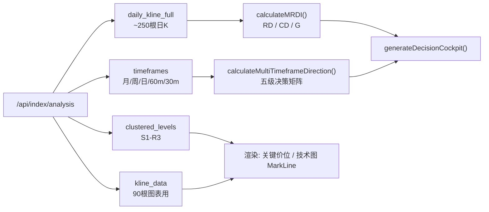

# MRDI 动量共振与多周期决策模型 — 实施总结

> **版本**: v1.1  
> **更新日期**: 2026-09-02  
> **关联文档**: [ALGORITHM_DOC.md §7.6 / §8.4 / §13](./ALGORITHM_DOC.md)（系统级算法与 v2.4 变更日志）

---

## 改动概览

**MRDI（Momentum Resonance & Decision Intelligence）动量共振与多周期决策模型** 是现有量化系统的第三个工作区，参考 [shorkamin.com/financial-analysis](https://www.shorkamin.com/financial-analysis/) 的设计理念构建。

### 修改文件

| 文件 | 版本 | 改动类型 | 说明 |
|------|------|---------|------|
| [index.html](frontend/index.html) | v1.0 | ADD | 第三个 Tab + 完整 MRDI 工作区 HTML (~345行) |
| [style.css](frontend/style.css) | v1.0 | ADD | MRDI 面板专属样式 (~1330行) |
| [app.js](frontend/app.js) | v1.1 | MODIFY | MRDI 计算引擎 + 渲染；v1.1 修复多周期链路与 RD/CD/G 口径 |
| [index_engine.py](backend/index_engine.py) | v2.4 | MODIFY | 新增 `timeframes` / `daily_kline_full`；G 分 MACD 去重；操作许可分支重排 |
| [cluster_engine.py](backend/cluster_engine.py) | v2.4 | MODIFY | 剔除 `boll_mid` 与 MA20 双重计分 |

> **v1.0 → v1.1 架构变化**  
> v1.0 声明"未修改任何后端 Python 代码"，MRDI 完全在前端自算指标。  
> v1.1 为打通**多周期决策矩阵**，后端 `/api/index/analysis` 新增 `timeframes` 与 `daily_kline_full`；MRDI 仍在前端计算 RD/CD/G，但**必须消费后端结构化多周期数据**，不再自行猜测周线/月线方向。

---

## 数据流与模块边界



| 数据 | 用途 | 禁止用法 |
|:---|:---|:---|
| `daily_kline_full` | MRDI 的 RD/CD/G、近 250 日分位 | ❌ 不要用 `kline_data`（仅 90 根） |
| `timeframes` | 月/周/日/60m/30m 方向与许可矩阵 | ❌ 不要用 `periods["1200"]`（periods 是数组） |
| `kline_data` / `all_kline_data` | ECharts 图表展示 | ❌ 不要用于 MRDI 核心打分 |

---

## 核心模型算法

### RD（反弹需求 Rebound Demand）

综合以下因子的加权评分（满分约 **114**），由唯一函数 `scoreMrdiRdCd(f)` 计算：

| 因子 | 条件 | 加分 |
|:---|:---|:---:|
| RSI 超跌 | < 20 / < 30 / < 40 | +25 / +18 / +8 |
| KDJ J 极端 | < 0 / < 10 / < 20 | +20 / +14 / +7 |
| 负乖离率 (vs MA20) | < -5% / < -3% / < -1.5% | +22 / +14 / +6 |
| MACD 绿柱收窄 | hist<0 且 hist>prevHist | +10 |
| 连续下跌天数 | ≥5 / ≥3 日 | +15 / +8 |
| 缩量超跌 | volRatio<0.6 且 deviation<-2% | +10 |
| 5日极端跌幅 | < -8% / < -5% | +12 / +6 |

**近 250 日分位**：对 `histStart = max(30, n-250)` 至当前每一根 K 线，用**同一** `scoreMrdiRdCd()` 得到历史 RD 序列，当前 RD 在该序列中的百分位即为 `rdPct`。**禁止**用简化 2 因子公式算分位（v1.0 缺陷，已在 v1.1 修复）。

### CD（回调压力 Callback Demand）

与 RD 对称设计（RSI/KDJ 超买、正乖离、红柱收窄、连涨、放量冲高等），同一 `scoreMrdiRdCd()` 输出 `{ rd, cd }`。

### G（拐点触发 Gate Trigger）

以 **0** 为中轴的动量方向指标，输出范围 **[-1, 1]**（v1.1 强制夹逼）：

| 组成部分 | 规则 | 量程 |
|:---|:---|:---:|
| MACD 金叉/死叉 | 前一根 DIF≤DEA 且当前 DIF>DEA → +0.3；死叉 → -0.3 | ±0.3 |
| MACD 连续动量 | 非交叉日：$4 \times \Delta(DIF-DEA) / ATR_{14}$ | ±0.3 |
| KDJ 金叉/死叉 | K 上穿/下穿 D | ±0.2 |
| 价格趋势 | 2 日涨跌幅 × 10 | ±0.3 |

阈值：**±0.15** 标记"方向初现"（`gState`: 正向初现 ↑ / 负向初现 ↓）。

> v1.1 修复：v1.0 的 `macdMomentum * 2` 无 ATR 归一化，上证指数 DIF 日变化 1～2 点即可淹没其他项；现按 ATR 缩放并整体 clamp 到 [-1, 1]。

### 多周期决策矩阵

决策优先级（由高到低）：

| 层级 | 数据来源 | 职责 |
|:---|:---|:---|
| **月线** | `timeframes.monthly`（后端周K→月K重采样） | 定**级别上限**（偏空→轻仓/半仓 cap） |
| **周线** | `timeframes.weekly` | 定**操作许可**（偏空→暂停观望） |
| **日线** | `timeframes.daily` + 前端 `analyzeTrend(daily_kline_full)` | 定**当前阶段** |
| **60分钟** | `timeframes["60m"]` | **确认延续**（rhythm 文案、确认阶梯） |
| **30分钟** | `timeframes["30m"]` | **捕捉时点**（确认阶梯，不单独决定仓位） |

操作许可合成逻辑（`calculateMultiTimeframeDirection`）：

1. 周线偏空/弱偏空 → `permission = 暂停观望`
2. 否则日线 score < -0.3 → `暂停观望`
3. 否则日线 score > 0.6 且周线偏多 → `允许正常操作`（受月线 cap 约束）
4. 否则日线 score > 0.3 且周线未偏空 → `允许轻仓试探`
5. 月线偏空时，即使日周共振也将 permission 压至 `允许轻仓试探`

驾驶舱在 `permission === 暂停观望` 且周线偏空时显示 **「周线不许可，防守观望」**（而非泛化的"大方向不明"）。

---

## v1.1 算法与链路修正 (2026-09-02)

> 与 [ALGORITHM_DOC.md §13](./ALGORITHM_DOC.md#13--v24-mrdi-多周期闭环与算法一致性修正-2026-09-02) 编号一一对应。

### 修复前缺陷（v1.0 审查发现）

| ID | 问题 | 影响 |
|:---|:---|:---|
| P0-16 | `periods` 为数组，前端 `periods["1200"]` 恒为 undefined | 周线/月线**永远显示"中性"**，多周期矩阵空转 |
| P0-17 | MRDI 使用 90 根 `kline_data` | MACD/KDJ 预热不足；"近250日分位"实际仅 ~60 样本 |
| P0-18 | 分位历史用 2 因子简化式，当前用 7 因子完整式 | `rdPct` / `cdPct` **统计无意义** |
| P0-19 | 后端大盘 G：Hist>0 与 DIF>DEA 重复计分 | MACD 单项可达 +0.40，扭曲操作许可 |
| P0-20 | 聚类 boll_mid 与 ma_20 双计 | 同一均线价位虚高 15～35 分 |
| P1-20 | 大盘"震荡蓄势"不要求日线非负且排在冲突判定前 | 周弱多+日走空+60分微正 → 误判可加仓 |
| P1-21 | G 的 MACD 连续项无量纲归一化 | 指数与个股 G 不可比 |
| P1-22 | 30/60 分钟确认阶梯用占位文案 | UI 显示"数据需更多K线"而非真实分时方向 |
| P1-23 | 驾驶舱 major 只显示日线 | 与设计"月线/周线定方向"不符 |

### 修复后行为（v1.1）

| ID | 修复方案 | 验证 |
|:---|:---|:---|
| P0-16 | 后端 `timeframes`；前端改读 `data.timeframes.weekly` 等 | 创业板 weekly=偏空 -0.35 ✅ |
| P0-17 | 后端 `daily_kline_full`（251 根）；MRDI 优先使用该字段 | 上证 251 根 ✅ |
| P0-18 | `scoreMrdiRdCd()` 单函数 + 历史循环共用 | RD 82.8% 分位与 RD=29 一致 ✅ |
| P0-19 | 见 ALGORITHM_DOC §7.2 MACD 单项规则 | 合成上涨 G=+0.85，MACD≤0.35 ✅ |
| P0-20 | cluster 剔除 boll_mid | 聚类 sources 无"中轨" ✅ |
| P1-20 | index_engine 分支重排 + 震荡蓄势需 daily G≥0 | 周+0.15/日-0.5 → 大方向不明 ✅ |
| P1-21 | `4*macdMomentum/ATR` + clamp | G ∈ [-1,1] ✅ |
| P1-22 | 阶梯读 `timeframes["30m"]`/`["60m"]` | rhythm=分时共振偏弱 ✅ |
| P1-23 | major=`周线 X / 月线 Y` | cockpit 文案正确 ✅ |

---

## UI 结构（工作区区块）

| 区块 | DOM / 函数 | 内容 |
|:---|:---|:---|
| 核心结论驾驶舱 | `#mrdiCockpit` / `renderMrdiCockpit` | 操作结论、大级别方向、盘中节奏、下一步 |
| 信号摘要卡 | `#mrdiSummaryCard` / `renderMrdiSignalCard` | RD/CD/G 触发的企稳/回调预警 |
| 三维评分 | `#mrdiRdScore` 等 / `renderMrdiScoreGrid` | RD、CD、G 数值 + 近250日分位 |
| 操作许可 | `#mrdiOperationCard` / `renderMrdiOperationCard` | permission + 五级矩阵理由列表 |
| 大级别方向 | `#mrdiDirectionCard` / `renderMrdiDirectionCard` | 月/周/日方向卡片 |
| 关键价位 | `renderMrdiLevels` | S1-S3 / R1-R3 来自 `clustered_levels` |
| 确认阶梯 | `#mrdiLadderGrid` / `renderMrdiLadder` | 30m → 60m → 日线 三级确认 |
| 条件成熟度 | `renderMrdiMaturityGrid` | 反弹/转弱/短线力量成熟度 |
| 冰点环境 | `renderMrdiEnvCard` | 连续急跌天数独立判断 |
| 技术核对图 | `#mrdiTechChart` / `renderMrdiTechChart` | K线 + MA + 成交量 + MACD + S/R MarkLine |

### 历史 UI 截图（v1.0 初版）


> v1.1 修复后，驾驶舱「大级别方向」与「盘中节奏」文案会随 `timeframes` 动态变化，与截图初版可能不同。

---

## 验证结果

### v1.0 冒烟测试（2026-08-31，UI 层）

- ✅ Tab 切换正常（三面板互斥切换）
- ✅ 核心结论驾驶舱、RD/CD/G 评分、关键价位、确认阶梯 UI 渲染
- ✅ 指数切换（上证/创业板/科创50/深证成指）数据联动
- ✅ 无 Console 报错

> ⚠️ v1.0 冒烟**未覆盖**多周期逻辑正确性；v1.1 审查发现 P0-16～P0-18 等链路级缺陷。

### v1.1 逻辑验证（2026-09-02，实盘 + 脚本）

| 检查项 | 方法 | 结果 |
|:---|:---|:---|
| 完整日K长度 | `IndexEngine.analyze_index_macro('sh000001')` | ✅ 251 根 full / 90 根 chart |
| timeframes 五周期 | API 返回 JSON | ✅ monthly/weekly/daily/60m/30m 均有 label+score |
| 聚类无 boll_mid 双计 | 检查 supports/resistances sources | ✅ 无"布林中轨" |
| MRDI 分位口径 | Node 脚本 `calculateMRDI(full)` | ✅ RD=29, rdPct=82.8%, G∈[-1,1] |
| 多周期 permission | 创业板 sz399006 | ✅ 周线偏空 → 暂停观望 → cockpit「周线不许可，防守观望」 |
| 大盘操作许可分支 | 上证周+0.15 日-0.5 | ✅ 大方向不明（非震荡蓄势） |
| 语法检查 | `node --check app.js` + `py_compile` | ✅ 通过 |

### 已知遗留（待下一迭代）

- MRDI 的 RD/CD/G 仍在前端 JS 重算，与后端 `rebound_cond`/`pullback_risk`/大盘 G **口径并存**，长期应下沉后端统一；
- `bullish_probability`（个股看板）仍非校准概率，需点时间评估框架验证；
- 回测胜率小样本问题未在本版处理（见 ALGORITHM_DOC §13 遗留说明）。

---

## 本地验证命令

```bash
# 启动后端
cd e:\code\A\backend
python app.py

# 浏览器访问第三个 Tab「MRDI」
# http://127.0.0.1:8000

# 快速检查 API 新字段（PowerShell）
Invoke-RestMethod "http://127.0.0.1:8000/api/index/analysis?symbol=sh000001" |
  Select-Object -ExpandProperty data |
  Select-Object @{n='full_bars';e={$_.daily_kline_full.Count}}, @{n='weekly';e={$_.timeframes.weekly.label}}
```

---

## 文档闭环索引

| 主题 | 本文档章节 | ALGORITHM_DOC 章节 |
|:---|:---|:---|
| RD/CD/G 公式与分位 | [核心模型算法](#核心模型算法) | §8.4 |
| 多周期 API 契约 | [数据流与模块边界](#数据流与模块边界) | §7.6 |
| 大盘 G 分 MACD 规则 | v1.1 P0-19 | §7.2 |
| 操作许可分支顺序 | v1.1 P1-20 | §7.4 |
| 聚类 boll_mid 去重 | v1.1 P0-20 | §4 |
| 完整变更编号与验证表 | [v1.1 修正](#v11-算法与链路修正-2026-09-02) | §13 |
