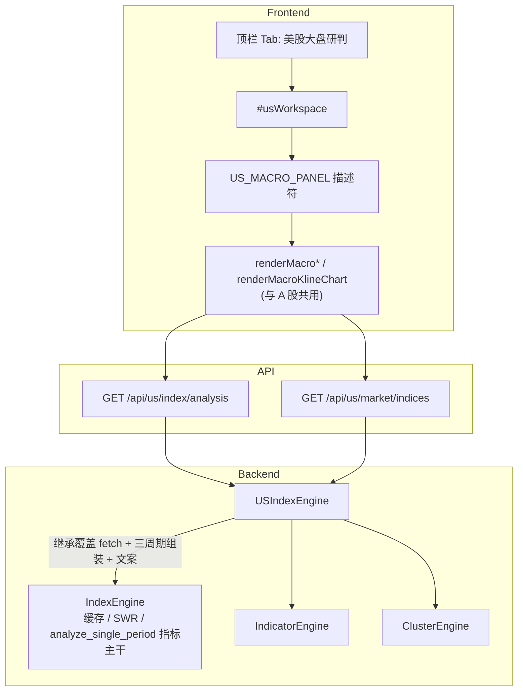

# 美股大盘研判 — 实施总结

> **版本**: v1.0  
> **实施日期**: 2026-09-14  
> **范围**: 仅「美股大盘多周期研判」TAB（不含美股个股看板 / 选股扫描 / 冰点校准）  
> **关联文档**: [README.md](./README.md) · [ALGORITHM_DOC.md](./ALGORITHM_DOC.md) · [ALGORITHM_REVIEW_2026-09-12.md](./ALGORITHM_REVIEW_2026-09-12.md)

---

## 一、结论（先读这段）

本模块在现有 A 股「大盘多周期研判」之上，新增第四个顶层工作区 **「美股大盘研判」**，对道指 / 标普500 / 纳指综合 / 纳指100 输出：

- 操作许可与建议仓位  
- 日 / 周 / **月** 三周期方向分与理解文案  
- 支撑压力价格带（S1–S3 / R1–R3）  
- 日 / 周 / 月 K 线图表（MA / 布林 / MACD）

**口径声明（与产品展示一致）**：

1. 方向分 \(G\)、操作许可、建议仓位均为**规则型技术评分**，未经概率校准，**不是胜率承诺**。  
2. 腾讯美股行情**无可用的 30/60 分钟 K 线接口**，故不做分时级研判；改为使用交易所口径**真实月 K**（约可回溯 10 年），形成「月线定战略 · 周线定波段 · 日线定节拍」。  
3. 美股无涨跌停、盘前盘后可交易、隔夜跳空频繁；仓位与止损须按跳空幅度预留冗余。  
4. 未实现美股冰点反弹模型（需单独历史分箱校准）；未改动 `scheduler.py` 的 A 股交易时段逻辑。

---

## 二、改动概览

### 修改 / 新增文件

| 文件 | 改动类型 | 说明 |
|------|---------|------|
| [backend/us_index_engine.py](backend/us_index_engine.py) | **新增** | `USIndexEngine`：腾讯美股快照 + usfqkline 日/周/月 K；继承 `IndexEngine` 的缓存 / SWR / 指标主干 |
| [backend/index_engine.py](backend/index_engine.py) | MODIFY | 将 `INDEX_META_MAP` / 周期根数 / 默认标的下沉为类属性（`META_MAP`、`PERIOD_COUNTS`、`DEFAULT_SYMBOL`），供跨市场子类覆盖；`warm_all` 日志打印实际类名 |
| [backend/app.py](backend/app.py) | MODIFY | 注册 `USIndexEngine`、启动预热线程；新增 `/api/us/index/analysis`、`/api/us/market/indices` |
| [frontend/index.html](frontend/index.html) | MODIFY | 顶栏 TAB「美股大盘研判」+ `#usWorkspace`（复用 A 股宏观面板结构；三周期卡片 / 无冰点卡） |
| [frontend/app.js](frontend/app.js) | MODIFY | `CN_MACRO_PANEL` / `US_MACRO_PANEL` 描述符；渲染函数参数化；`bindUsMacroEvents` / `switchWorkspaceView` |
| [frontend/style.css](frontend/style.css) | MODIFY | `.us-ticker`、`.us-scope-note`、`.periods-trio-grid` 及移动端适配 |
| [README.md](README.md) | MODIFY | 特性说明、数据源、目录结构同步 |

> **未改动（刻意）**  
> - `scheduler.py`：保活仍按 A 股时段（09:25–15:05）；美股依赖启动预热 + 引擎 TTL/SWR + 面板可见时 60s 轮询。  
> - `ice_engine.py` / 冰点校准：美股无对应历史分箱模型。  
> - `data_fetcher.py` / `scanner_engine.py`：本轮不做美股个股与扫描。

---

## 三、范围决策（实施时的产品选择）

| 候选项 | 是否纳入 v1.0 | 原因 |
|--------|---------------|------|
| 美股大盘多周期研判 | ✅ | 与现有 `IndexEngine` 契约最接近，可整套复用评分 / 聚类 / 操作许可 |
| UI 完全复用 A 股宏观面板风格 | ✅ | 降低认知切换成本；仅替换指数胶囊、周期键与口径说明 |
| 美股个股量化看板 | ❌ | 需独立 `USDataFetcher` + 流通盘/换手等口径，另立项 |
| 美股选股扫描雷达 | ❌ | 依赖个股分析管道 |
| 美股冰点反弹模型 | ❌ | 需按指数重建分箱校准与样本外诊断，工作量最大 |

---

## 四、数据源探测结论（留档依据）

实施前对腾讯 / 新浪免 Token 接口做了探测（探测脚本未入库）。关键结论：

### 4.1 可用

| 用途 | 接口 / 代码格式 | 备注 |
|------|-----------------|------|
| 实时快照 | `http://qt.gtimg.cn/q=usDJI` 等 | **大小写敏感**：`usdji` / `us.ixic` 返回空 |
| 日 / 周 / 月 K | `https://web.ifzq.gtimg.cn/appstock/app/usfqkline/get?param={code},{day\|week\|month},,,{n},qfq` | 指数返回键为 `day`/`week`/`month`（无 `qfq` 前缀）；个股才有 `qfqday` 等 |
| 四大指数代码 | `usDJI`、`usINX`、`us.IXIC`、`usNDX` | 路由层用全小写 key：`usdji` / `usinx` / `usixic` / `usndx`，内部映射到 `quote_code` |
| 历史深度 | 日 250 / 周 260 / 月 120 根均可返回 | 月 K 约 10 年 |

### 4.2 不可用 / 放弃

| 对象 | 结果 |
|------|------|
| 30/60 分钟 K（`mkline` / `usmkline` / `usfqkline`+m30） | 全部失败（param error / 控制器不存在 / bad params） |
| 罗素 2000（`usRUT` / `us.RUT`） | 无匹配 |
| 费城半导体（`usSOX`） | 无匹配 |
| VIX（`usVIX`） | 有返回但停更于约 2026-02，OHLC 多为 0，不可用 |

### 4.3 与 A 股字段差异

- 快照时间 `parts[30]` 为 `"YYYY-MM-DD HH:MM:SS"` 文本，不是 A 股紧凑串。  
- 成交量单位已是**股**，成交额为行情商美元口径估算；**不参与研判打分**，仅图表量能形态。  
- 指数 K 线不复权（`qfq` 参数对指数基本无意义）。

---

## 五、架构与复用边界



### 5.1 后端：继承而非复制

`USIndexEngine(IndexEngine)` **只覆盖**：

1. **行情抓取**：`_fetch_index_realtime_raw`、`fetch_index_kline`（含日 K 实时合并）  
2. **研判组装**：`_analyze_sync`（日/周/月三周期；`indicators_60m=None`）  
3. **理解文案**：`analyze_single_period` 先调父类算 \(G\)/斜率/状态，再替换美股语境文案  
4. **scale 归一**：未知周期落到 `day`，避免污染缓存键与响应 `scale` 字段

**完整复用父类**：TTL 分级缓存、stale-while-revalidate、`analyze_single_period` 中的指标与方向分公式、支撑压力聚类、预热 `warm_all`。

父类为支持子类做的参数化：

```text
META_MAP / DEFAULT_SYMBOL / PERIOD_COUNTS / KLINE_TTL
```

研判与预热必须共用同一份 `PERIOD_COUNTS`——缓存键含 `count`，两处不一致会导致预热失效。

### 5.2 操作许可分支（与 A 股对称，锚点上移）

| 顺序 | 条件 | 许可 |
|------|------|------|
| 1 | 月线 \(G \ge 0.2\) 且周线 \(G \ge 0.2\) | 多头顺势，逢低做多 |
| 2 | 月线 \(G < 0\) 且周线 \(G < 0\) | 空头承压，防守观望 |
| 3 | 月周方向冲突（异号且 \|G\| 均 ≥ 0.1） | 大方向不明，先观望 |
| 4 | 月线 \(G \ge 0.1\) 且周线 \(G \ge 0\) 且日线 \(G > 0\) | 震荡蓄势，区间波段 |
| 5 | 其余 | 大方向不明，先观望 |

对比 A 股：大方向锚点由「周线 + 日线 + 60 分」整体上移为「月线 + 周线 + 日线」。

### 5.3 「周期进行中」标注

周 / 月 K 最后一根在周期未结束时成交量仍在累积，量比与斜率天然偏低，易被误读为「缩量 / 动能衰减」。

- 后端：`_is_period_in_progress` 按日历月 / ISO 周判断；字段 `in_progress: bool`；文案追加说明。  
- 前端：周期卡片时间旁金色「周期进行中」（A 股无此字段，不受影响）。

---

## 六、API 契约

### 6.1 `GET /api/us/index/analysis`

| 参数 | 类型 | 默认 | 说明 |
|------|------|------|------|
| `symbol` | Literal | `usdji` | `usdji` / `usinx` / `usixic` / `usndx` |
| `scale` | Literal | `day` | `day` / `week` / `month` |

非法 `symbol` / `scale`（如 A 股代码、`30`）由 FastAPI `Literal` 校验返回 **422**。

响应 `data` 关键字段：

| 字段 | 说明 |
|------|------|
| `market` | 固定 `"US"` |
| `symbol` / `quote_code` / `name` / `desc` | 路由 key 与腾讯真实代码 |
| `current_price` / `change_pct` / `quote_time` / `update_time` | 报价与本地计算时间 |
| `conclusion` | 与 A 股同构：`op_license`、四段卡片文案等 |
| `periods` | **长度 3**，顺序 **月线 → 周线 → 日线**；含 `in_progress` |
| `clustered_levels` | 支撑 / 压力带 |
| `all_kline_data` | `{ day, week, month }` 图表用截断序列 |
| `kline_data` | 当前 `scale` 对应序列 |
| `timeframes` | `{ monthly, weekly, daily }`（无 30m/60m） |
| `daily_kline_full` | 全日 K（供后续扩展，当前 UI 主用图表截断） |
| `scale` | 归一后的实际周期 |

### 6.2 `GET /api/us/market/indices`

四大指数快照列表：`code` / `name` / `price` / `change_pct` / `quote_time`。

### 6.3 与 A 股接口隔离

| 市场 | 分析 | 指数条 |
|------|------|--------|
| A 股 | `/api/index/analysis` | `/api/market/indices` |
| 美股 | `/api/us/index/analysis` | `/api/us/market/indices` |

周期键不同：A 股 `30`/`60`/`240`/`1200`；美股 `day`/`week`/`month`。前端不得混用。

---

## 七、前端实现要点

### 7.1 面板描述符

`CN_MACRO_PANEL` / `US_MACRO_PANEL` 承载差异：

- API 路径、DOM id、图表标题、`scaleNames`、`longDateScales`  
- 通过 getter/setter 绑定各自全局状态（`currentMacroSymbol` vs `currentUsSymbol` 等）

`loadMacroIndexAnalysis` / `renderMacro*` / `renderMacroKlineChart` 均接受可选 `panel`，默认 A 股，**既有调用点无需改动**。

### 7.2 选择器作用域（必守）

美股复用了 `.index-capsule-btn`、`.m-btn` 等 class。**禁止**全局 `querySelectorAll(".m-btn")`——会跨面板串选。

正确写法：容器限定，例如：

- `#usIndexCapsuleTabs .index-capsule-btn`  
- `#usWorkspace .macro-chart-toolbar .m-btn`

封装为 `bindMacroCapsules` / `bindMacroScaleButtons`。

### 7.3 顶栏四工作区切换

`WORKSPACE_TABS` + `switchWorkspaceView`：隐藏全部工作区后只显示目标。`stockWorkspace` 用 `grid`，其余用 `flex`。

美股数据：**首次切入该 TAB 才加载**，不拖慢首屏；TAB 可见时每 60s 静默轮询指数条 + 研判。

### 7.4 UI 组成（与 A 股宏观对齐，差异如下）

| 区块 | 美股 |
|------|------|
| 行情条 | `#usMarketTicker`，可点选切换指数 |
| 胶囊 | 道指 / 标普 / 纳指综合 / 纳指100 |
| 冰点卡 | **无** |
| 口径说明 | `.us-scope-note` 明示无分时、真实月 K、跳空等 |
| 周期矩阵 | 三列 `.periods-trio-grid` |
| 图表周期 | 日 / 周 / 月 |

静态资源版本：`style.css?v=2.9.0`、`app.js?v=2.9.0`（防缓存）。

---

## 八、缓存与保鲜策略

| 层级 | 行为 |
|------|------|
| 引擎 K 线 TTL | day 60s / week 300s / month 900s |
| 实时快照 TTL | 10s（继承父类 `REALTIME_TTL`） |
| 研判结果 | 父类 stale-while-revalidate：过期先返回旧结果，后台刷新 |
| 启动预热 | `us-index-prewarm` 线程：`warm_all` 四大指数 × 三周期 |
| 前端 | 面板可见时 60s 轮询；切换指数优先渲染 `usMacroCache` 快照 |

**已知缺口**：`RefreshScheduler` 在 A 股 15:05 后直接 return，美股盘中（北京时间夜间）落在保活盲区。当前靠预热 + TTL/SWR + 可见轮询；若需分钟级保活，需另增美股时段（含夏令时）。

---

## 九、验证记录（2026-09-14）

### 9.1 自动化

- 后端语法 / 前端 `node --check` 通过  
- 既有回归：`test_calibration_*` / `test_prediction_*` / `test_execution_*` / `test_scanner_*` + 前端 `test_display_regressions.cjs` 共 **53** 项通过  
- HTTP 冒烟：四大指数 × 三周期、契约字段、422 非法入参、A 股接口 `periods=4` 与四周期图表齐备  
- Playwright：TAB 切换、胶囊 / 行情条联动、周期切换不串改 A 股按钮、三周期卡片顺序、移动端单列、零业务 JS 错误  

### 9.2 验证时踩坑（勿当成功能回归）

盘后调度器触发全市场扫描（约 240 只）曾把腾讯接口打到限流，表现为 A 股 `stock/analysis` 404、分时 K 暂时为空。限流恢复后全部恢复。**与美股代码路径无关**（美股走 `usfqkline` / 独立引擎）。

### 9.3 视觉细节

- Windows 上国旗 emoji `🇺🇸` 会退化为字母方块，TAB 图标改用 `🗽`。  
- 月 K Y 轴为 `20,000` 等千分位格式，缩略图易被误读为 `20.0`；以 ECharts `scale.getTicks()` 为准。

---

## 十、明确未做 / 后续可选

| 项 | 说明 |
|----|------|
| 美股个股看板 | 需 `USDataFetcher` + 无涨跌停的评分/计划卡调整 |
| 美股选股扫描 | 依赖个股管道 + 美股活跃池列表（新浪美股列表接口曾探测可用） |
| 美股冰点模型 | 按指数独立校准 + 样本外诊断，勿复用 A 股校准表 |
| 调度器美股时段 | 跨日 + 夏令时；与 A 股保活解耦 |
| MRDI 接美股 | 当前 MRDI 仍绑 `/api/index/analysis` 与 A 股 `timeframes`（含 30m/60m）；接入需改矩阵层级定义 |
| 罗素 / 费半 / VIX | 当前行情源不可用或数据不可信 |

---

## 十一、关键代码索引

| 主题 | 位置 |
|------|------|
| 美股元数据与引擎 | `backend/us_index_engine.py` |
| 父类参数化 | `backend/index_engine.py` → `META_MAP` / `PERIOD_COUNTS` / `warm_all` |
| HTTP 路由 | `backend/app.py` → `/api/us/index/analysis`、`/api/us/market/indices` |
| 面板描述符 | `frontend/app.js` → `CN_MACRO_PANEL` / `US_MACRO_PANEL` |
| 美股事件绑定 | `frontend/app.js` → `bindUsMacroEvents` / `selectUsIndex` / `loadUsMarketIndices` |
| 工作区切换 | `frontend/app.js` → `switchWorkspaceView` |
| DOM 结构 | `frontend/index.html` → `#tabUsView` / `#usWorkspace` |
| 样式 | `frontend/style.css` → `.us-ticker` / `.us-scope-note` / `.periods-trio-grid` |

---

## 十二、免责声明（文档级）

本模块仅供量化研究与技术学习交流，**不构成投资建议或交易依据**。美股隔夜跳空、盘前盘后流动性与规则型评分均可能导致展示信号与可执行交易结果严重偏离。使用者据此决策，风险自负。
